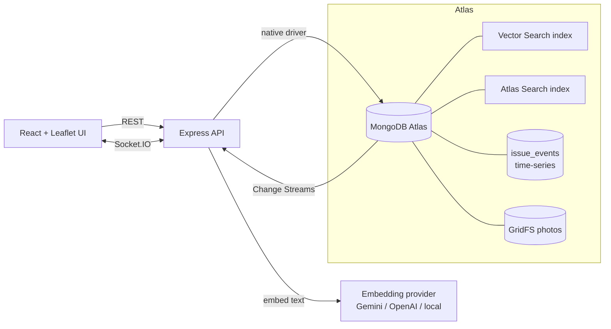

# FixMyCampus

> AI-powered campus and civic issue reporter built on **MongoDB Atlas**. It uses vector + geo hybrid search to catch duplicate reports, change streams to update the map live, and time-series collections for analytics.

Students and citizens report problems (broken streetlights, water leaks, potholes, dirty washrooms, WiFi outages) with a photo, a description, and a location. As a user types, FixMyCampus uses **Atlas Vector Search combined with a geospatial filter** to find semantically similar open issues within ~200 m, and suggests: *"This looks already reported — upvote it instead?"* Admins watch new issues appear on a **live map**, assign them to departments inside **ACID transactions**, and track trends on an **analytics dashboard**.

---

## Why MongoDB

Every feature here exists because the product needs it, not only to tick a box.

| MongoDB feature | Where it's used | Why |
|---|---|---|
| **Atlas Vector Search** | Duplicate detection (`POST /api/issues/similar`) | Finds reports that *mean* the same thing even when the wording differs |
| **Geospatial queries** (`2dsphere`, `$geoNear`, `$geoWithin`) | Nearby issues, map viewport loading, duplicate radius filter | A leak in Block C is only a duplicate if it's *near* the other one |
| **Atlas Search** | Full-text search with fuzzy matching, autocomplete, facets, highlights | Fast, typo-tolerant search with category and status counts |
| **Change Streams** (with resume tokens) | Live map and department feeds over Socket.IO | New and updated issues appear on screen instantly |
| **Aggregation pipelines** (`$facet`, `$lookup`, `$bucket`, `$setWindowFields`, `$dateDiff`) | Analytics dashboard | Overview, department performance, hotspots, SLA breaches |
| **Time-series collections** | `issue_events` trend analytics | Efficient storage and querying of lifecycle events over time |
| **Multi-document transactions** | Assigning and resolving issues | Updates the issue, department workload, and audit log atomically |
| **GridFS** | Issue photo storage | Stores images alongside the data, streamed back on demand |
| **Schema design** (`$jsonSchema` validation, polymorphic docs, subset pattern) | `issues` collection | Category-specific fields, bounded embedded comments and status history |
| **Index strategy** (compound ESR, partial, unique) | `db/setup.ts` | Every hot query is served by an `IXSCAN`, verified with `explain()` |

## Architecture



See [`docs/ARCHITECTURE.md`](docs/ARCHITECTURE.md) for the schema design, index strategy, and pipeline walkthroughs.

## Screenshots

> _Coming soon: live map, duplicate detection, admin dashboard._

## Tech stack

- **Frontend:** React, Vite, TypeScript, TailwindCSS, react-leaflet, Recharts, TanStack Query, socket.io-client
- **Backend:** Node 20, TypeScript, Express, official `mongodb` driver (no Mongoose, by design), Socket.IO, zod, JWT
- **Database:** MongoDB Atlas (Vector Search, Atlas Search, Change Streams, Time Series, GridFS, Transactions)
- **Embeddings:** pluggable (Gemini `text-embedding-004`, OpenAI `text-embedding-3-small`, or a local fallback that needs no API key)

## Quick start

1. **Create an Atlas cluster.** A free M0 cluster works. Add your IP to the access list and copy the connection string.
2. **Configure your environment:**
   ```bash
   cp .env.example .env   # fill in MONGODB_URI, JWT_SECRET, and optionally GEMINI_API_KEY
   ```
3. **Install, set up the database, and seed demo data:**
   ```bash
   npm install
   npm run db:setup   # collections, validators, indexes, search indexes
   npm run seed       # departments, users, ~150 campus issues
   npm run dev        # starts the API and the web app
   ```
4. Log in as `admin@fixmycampus.dev` / `Admin@123`.

## Project structure

```
apps/
  api/        Express + MongoDB native driver
  web/        React + Vite frontend
packages/
  shared/     Shared TypeScript types and zod schemas
docs/         Architecture notes and demo script
```

## Status

🚧 Under active development for the MongoDB hackathon.

## Team

Built by [@Noyoucringe](https://github.com/Noyoucringe) and team.
