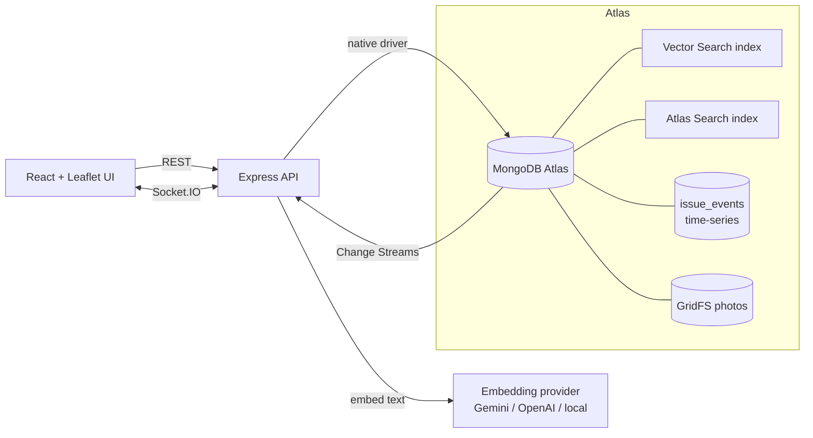

# FixMyCampus

AI-powered campus and civic issue reporter built on MongoDB Atlas. It uses vector and geospatial hybrid search to catch duplicate reports, change streams to update the map live, and time-series collections for analytics.

## Overview

Students and citizens report problems such as broken streetlights, water leaks, potholes, and WiFi outages with a photo, a description, and a location. While a user types, FixMyCampus finds semantically similar open issues within about 200 m and suggests upvoting the existing report instead of filing a duplicate. Admins see new issues appear on a live map, assign them to departments inside ACID transactions, and track trends on an analytics dashboard.

## MongoDB Features

| Feature | Where it is used | Why |
|---|---|---|
| Atlas Vector Search | Duplicate detection (`POST /api/issues/similar`) | Matches reports by meaning, even when the wording differs |
| Geospatial queries (`2dsphere`, `$geoNear`, `$geoWithin`) | Nearby issues, map viewport loading, duplicate radius filter | A report is only a duplicate if it is also nearby |
| Atlas Search | Full-text search with fuzzy matching, autocomplete, facets, highlights | Typo-tolerant search with category and status counts |
| Change Streams (with resume tokens) | Live map and department feeds over Socket.IO | New and updated issues appear instantly, with no missed events after a reconnect |
| Aggregation pipelines (`$facet`, `$lookup`, `$bucket`, `$setWindowFields`, `$dateDiff`) | Analytics dashboard | Overview, department performance, hotspots, SLA breaches |
| Time-series collections | `issue_events` trend analytics | Efficient storage and querying of lifecycle events |
| Multi-document transactions | Assigning and resolving issues | Issue, department workload, and audit log update atomically |
| GridFS | Issue photo storage | Images are stored with the data and streamed on demand |
| Schema design (`$jsonSchema` validation, polymorphic documents, subset pattern) | `issues` collection | Category-specific fields, bounded embedded comments and status history |
| Index strategy (compound ESR, partial, unique) | `db/setup.ts` | Hot queries are served by an `IXSCAN`, verified with `explain()` |

The backend uses the official `mongodb` driver directly, with no ODM.

## How It Works

1. **Duplicate detection:** the report text is embedded and matched against open issues with Atlas Vector Search, then restricted to a 200 m radius with a geospatial filter.
2. **Live updates:** a change stream on `issues` feeds Socket.IO, and resume tokens replay events missed during a disconnect.
3. **Assignment:** a multi-document transaction updates the issue, the department workload, and the audit log together.
4. **Analytics:** aggregation pipelines compute the dashboard in the database, and lifecycle events are stored in a time-series collection.

## Architecture


```mermaid
flowchart LR
  U[React + Leaflet UI] -- REST --> API[Express API]
  U <-- Socket.IO --> API
  API -- embed text --> EMB[Embedding provider<br/>Gemini / OpenAI / local]
  API -- native driver --> DB[(MongoDB Atlas)]
  DB -- Change Streams --> API
  subgraph Atlas
    DB --- VS[Vector Search index]
    DB --- AS[Atlas Search index]
    DB --- TS[(issue_events<br/>time-series)]
    DB --- GFS[(GridFS photos)]
  end
```
## Technologies Used

- MongoDB Atlas
- TypeScript
- React
- Node.js
- AI-powered search

Schema design, index strategy, and pipeline walkthroughs are in [`docs/ARCHITECTURE.md`](docs/ARCHITECTURE.md).

## Tech Stack

| Layer | Technology |
|---|---|
| Database | MongoDB Atlas (Vector Search, Atlas Search, Change Streams, Time Series, GridFS, Transactions) |
| Backend | Node 20, TypeScript, Express, official `mongodb` driver, Socket.IO, zod, JWT |
| Frontend | React, Vite, TypeScript, TailwindCSS, react-leaflet, Recharts, TanStack Query, socket.io-client |
| Embeddings | Pluggable: Gemini, OpenAI, or a local fallback that needs no API key |

## Getting Started

1. Create a free M0 Atlas cluster, add your IP to the access list, and copy the connection string.
2. Configure the environment:
```bash
   cp .env.example .env
```
   Set `MONGODB_URI` and `JWT_SECRET`. An embedding API key is optional.
3. Install, set up the database, seed demo data, and run:
```bash
   npm install
   npm run db:setup   # collections, validators, indexes, search indexes
   npm run seed       # departments, users, ~150 campus issues
   npm run dev        # API and web app
```

## Project Structure

```
fixmycampus/
├── apps/
│   ├── api/                 Express + MongoDB native driver
│   │   └── src/
│   │       ├── db/          Connection, setup.ts (collections, validators, indexes, search indexes)
│   │       ├── routes/      REST endpoints (issues, analytics, auth)
│   │       ├── services/    Duplicate detection (vector + geo), embeddings, transactions
│   │       ├── streams/     Change stream listeners and Socket.IO events
│   │       └── seed/        Demo data (departments, users, ~150 issues)
│   └── web/                 React + Vite frontend
│       └── src/
│           ├── pages/       Report form, live map, admin dashboard
│           ├── components/  Map, charts, issue cards
│           └── hooks/       Data fetching and Socket.IO subscriptions
├── packages/
│   └── shared/              Shared TypeScript types and zod schemas
├── docs/
│   └── ARCHITECTURE.md      Schema design, index strategy, pipeline walkthroughs
├── .env.example
└── package.json
```
## 👥 Team LogicNest

Built for *Code for Change with MongoDB*

| # | Name | Department |
|---|------|------------|
| 1 | Meghamsh Anirudh Pulivendala | CSE |
| 2 | Puligadda Srirama Bharath | CSE |
| 3 | Ponugoti Ranadeep | CSE |
| 4 | S. Jeathraditya | CSE |
