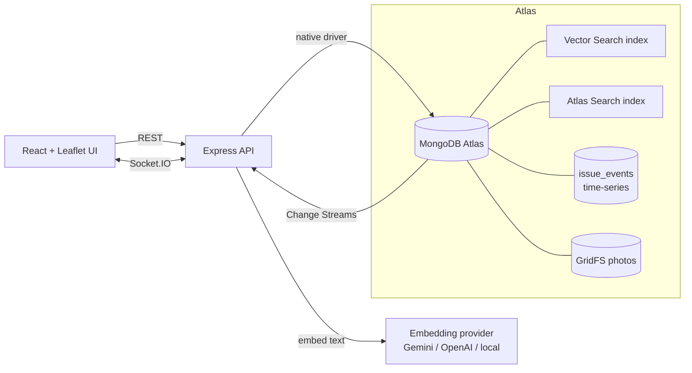

<div align="center">

# 📍 FixMyCampus

### Report it once. MongoDB makes sure it's fixed once.

**An AI-powered campus and civic issue reporter where every core feature runs on a native MongoDB capability.**


[🎥 Demo Video](#) · [🌐 Live Demo](#) · [📐 Architecture](docs/ARCHITECTURE.md)

</div>

---

## 🚨 The problem

Campuses and cities don't suffer from a lack of reports. They suffer from **duplicate, scattered, untracked** ones. Ten students report the same leaking pipe in ten different ways, and the admin sees ten tickets with no shared context and no way to tell they're the same problem.

## 💡 The solution

FixMyCampus turns MongoDB into the brain of the reporting flow:

1. **A student types** *"water dripping near block C stairs."*
2. **Atlas Vector Search + geospatial filtering** finds open issues that *mean* the same thing within ~200 m.
3. The app suggests: *"This looks already reported. Upvote it instead?"*
4. **Change Streams** push every new or updated issue to the admin's **live map** instantly.
5. Admins assign issues inside an **ACID transaction**, and the **aggregation dashboard** shows what's actually going wrong on campus.

> **No keyword matching. No manual dedup. No polling.** Just MongoDB doing what it does best.

---

## 🍃 MongoDB at the core

Every feature exists because the product needs it, not to tick a box.

| MongoDB capability | Where it's used | Why it matters |
|---|---|---|
| 🧠 **Atlas Vector Search** | Duplicate detection (`POST /api/issues/similar`) | Matches reports by *meaning*, even when the wording differs |
| 🌍 **Geospatial** (`2dsphere`, `$geoNear`, `$geoWithin`) | Nearby issues, map viewport loading, duplicate radius | A leak in Block C is only a duplicate if it's *near* the other one |
| 🔎 **Atlas Search** | Fuzzy full-text search, autocomplete, facets, highlights | Typo-tolerant search with live category and status counts |
| ⚡ **Change Streams** (with resume tokens) | Live map and department feeds via Socket.IO | Real-time updates with no polling, and no missed events after a reconnect |
| 📊 **Aggregation pipelines** (`$facet`, `$lookup`, `$bucket`, `$setWindowFields`, `$dateDiff`) | Analytics dashboard | Overview, department performance, hotspots, SLA breaches, all computed in the database |
| ⏱️ **Time-series collections** | `issue_events` trend analytics | Efficient storage and querying of lifecycle events over time |
| 🔐 **Multi-document ACID transactions** | Assigning and resolving issues | Issue, department workload, and audit log update atomically or not at all |
| 🖼️ **GridFS** | Issue photo storage | Images live beside the data and stream back on demand |
| 🧱 **Schema design** (`$jsonSchema` validation, polymorphic documents, subset pattern) | `issues` collection | Category-specific fields, bounded embedded comments and status history |
| 🚀 **Index strategy** (compound ESR, partial, unique) | `db/setup.ts` | Every hot query is served by an `IXSCAN`, verified with `explain()` |

> 💬 **Design choice:** we use the **official `mongodb` driver with no ODM** (no Mongoose), so every MongoDB feature is used directly and nothing is hidden behind an abstraction.

---

## 🎬 How it works

### 1. Duplicate detection: vector + geo hybrid search
Report text is embedded and matched against open issues with Atlas Vector Search. The results are then constrained to a ~200 m radius with a geospatial filter. Semantic similarity alone finds *similar* problems, and adding location finds *the same* problem.

```js
// Illustrative shape of the hybrid query
db.issues.aggregate([
  { $vectorSearch: {
      index: "issue_vector_idx",
      path: "embedding",
      queryVector,
      numCandidates: 100,
      limit: 10,
      filter: { status: "open" }
  }},
  { $match: { location: { $geoWithin: { $centerSphere: [[lng, lat], 200 / 6378100] } } } },
  { $project: { title: 1, status: 1, score: { $meta: "vectorSearchScore" } } }
])
```

### 2. Live operations: Change Streams
A change stream on `issues` feeds Socket.IO. New reports and status changes appear on the admin map and department feeds within moments. **Resume tokens** mean a dropped connection replays missed events instead of losing them.

### 3. Integrity: transactions
Assigning an issue touches three things: the **issue**, the **department workload**, and the **audit log**. A multi-document transaction guarantees all three change together, or none do.

### 4. Insight: aggregation + time-series
The dashboard is powered by aggregation pipelines running inside MongoDB: `$facet` for multi-panel overviews, `$setWindowFields` for trends, `$dateDiff` for SLA breach detection, and `$bucket` for distributions. Lifecycle events land in a **time-series collection** built for exactly this workload.

---

## 🏗️ Architecture


```mermaid
flowchart LR
  U[React + Leaflet UI] -- REST --> API[Express API]
  U <-- Socket.IO --> API
  API -- embed text --> EMB[Embedding provider<br/>Gemini / OpenAI / local]
  API -- native driver --> DB[(MongoDB Atlas)]
  DB -- Change Streams --> API
  subgraph Atlas
    DB --- VS[Vector Search index]
    DB --- AS[Atlas Search index]
    DB --- TS[(issue_events<br/>time-series)]
    DB --- GFS[(GridFS photos)]
  end
```

Deep dive on schema design, index strategy, and pipeline walkthroughs: [`docs/ARCHITECTURE.md`](docs/ARCHITECTURE.md)

## 📸 Screenshots

| Live admin map | Duplicate detection | Analytics dashboard |
|---|---|---|
| _add screenshot_ | _add screenshot_ | _add screenshot_ |

## 🧰 Tech stack

| Layer | Technology |
|---|---|
| **Database** | **MongoDB Atlas**: Vector Search, Atlas Search, Change Streams, Time Series, GridFS, Transactions |
| **Backend** | Node 20, TypeScript, Express, official `mongodb` driver, Socket.IO, zod, JWT |
| **Frontend** | React, Vite, TypeScript, TailwindCSS, react-leaflet, Recharts, TanStack Query |
| **Embeddings** | Pluggable: Gemini, OpenAI, or a local fallback that needs no API key |

## ⚙️ Run it locally

```bash
# 1. Create a free M0 Atlas cluster and add your IP to the access list
# 2. Configure environment
cp .env.example .env      # set MONGODB_URI and JWT_SECRET (embedding key optional)

# 3. Install, provision the database, seed demo data, run
npm install
npm run db:setup          # collections, validators, indexes, search indexes
npm run seed              # departments, users, ~150 campus issues
npm run dev               # API + web app
```

## 📁 Project structure

```
apps/
  api/        Express + MongoDB native driver
  web/        React + Vite frontend
packages/
  shared/     Shared TypeScript types and zod schemas
docs/         Architecture notes and demo script
```

## 👥 Team LogicNest

Built for *Code for Change with MongoDB*

| # | Name | Department |
|---|------|------------|
| 1 | Meghamsh Anirudh Pulivendala | CSE |
| 2 | Puligadda Srirama Bharath | CSE |
| 3 | Ponugoti Ranadeep | CSE |
| 4 | S. Jeathraditya | CSE |

---

<div align="center">

**Built on MongoDB Atlas. Every feature earns its place.** 🍃

</div>
